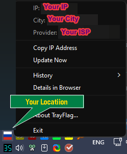

# TrayFlag v1.1.0

**A simple and powerful tray indicator for your current IP address location, now rebuilt with Nuitka for enhanced performance.**

TrayFlag is a lightweight, portable utility for Windows that displays the flag of your current IP address's country right in the system tray. It's an ideal tool for VPN users, developers, and anyone who wants to quickly monitor their network location.

This version marks a significant technical upgrade, moving from PyInstaller to Nuitka for a faster, more optimized experience.

 

## Features

*   **Real-time Tray Icon:** Instantly see the country flag of your current IP.
*   **Detailed Information:** A clean tooltip shows your IP, country code, city, and provider. The context menu provides full, unabbreviated details.
*   **Interactive History:** View and copy your last 3 IP locations directly from the menu.
*   **Adaptive Updates:** An intelligent timer saves resources by switching between a fast "active" mode and a slower "idle" mode.
*   **Fully Portable:** Leaves no traces in the registry. All settings are stored in a local `TrayFlag.ini` file.
*   **Customizable:** A user-friendly settings dialog to control update intervals, notifications, sound, and autostart behavior.
*   **Multilingual:** Supports multiple languages with auto-detection of your system's language on first launch.

### What's New in v1.1.0

*   **Nuitka Compilation:** The application is now compiled with Nuitka, translating Python code to C for a significant performance boost and faster startup.
*   **Optimized File Structure:** The distribution is now organized with a clean root directory. The main executable is a lightweight launcher, while all dependencies are neatly stored in a `bin` subfolder.

## Installation

1.  Go to the [**Releases**](https://github.com/Ridbowt/TrayFlag/releases) page.
2.  Download the latest `.zip` archive (e.g., `TrayFlag-v1.1.0-windows-x64.zip`).
3.  Unzip the archive to any folder on your computer.
4.  Run `TrayFlag.exe`.

## System Requirements

*   **Operating System:** Windows 10 (x64) or Windows 11 (x64).
*   *Note: The application is not compatible with Windows 7/8 or 32-bit systems due to limitations of modern Python versions and required libraries.*

## How to Contribute

Found a bug or have an idea for a new feature? Feel free to open a new issue in the [**Issues**](https://github.com/Ridbowt/TrayFlag/issues) section.

You can also contribute by translating TrayFlag into your language! The translation files are located in `TrayFlag/assets/i18n/`. Simply copy `en.json`, translate the values, and share the new file.

---
*This application was created by an enthusiast with significant support and consultation from AI assistants (Google AI Studio, ChatGPT).*