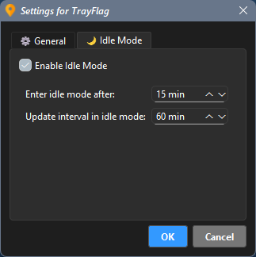

# TrayFlag 

**English** | [Русский](README.ru.md)

A simple and powerful tray indicator for your current IP address location.

TrayFlag is a lightweight, portable utility for Windows that displays the flag of your current IP address's country right in the system tray. It's an ideal tool for anyone who wants to quickly monitor their network location.

## Features
- **Real-time Tray Icon:** Instantly see the country flag of your current IP.
- **Intelligent IP Monitoring:** The application efficiently monitors your external IP address, requesting full geolocation data (country, city, ISP) only when necessary. This approach significantly reduces the number of requests to geolocation services, making the app more efficient and reliable.
- **Resilient Operation:** If geolocation services are temporarily unavailable or your internet connection is lost, the application will actively attempt to restore connection and provide essential information. An audible alert can notify you of network issues.
- **Detailed Information:** A clean tooltip shows your IP, country code, city, and provider. The context menu provides full, unabbreviated details.
- **Interactive History:** View and copy your last 3 IP locations directly from the menu.
- **Consistent Updates:** The application now consistently checks your IP at a single, user-defined "Update Interval" (e.g., every 7 seconds with a small random variation), ensuring continuous monitoring.
- **Fully Portable:** Leaves no traces in the registry. All settings are stored in a local `TrayFlag.ini` file. The `TrayFlag.ini` file's version is automatically updated upon launch if it differs from the application's version.
- **Customizable:** A user-friendly settings dialog to control the "Update Interval", notifications, sound, and autostart behavior.
- **Multilingual:** Supports multiple languages with auto-detection of your system's language on first launch.

## Installation
1. Go to the [Releases](https://github.com/Ridbowt/TrayFlag/releases) page.
2. Download the latest `.zip` archive (e.g., `TrayFlag-v1.5.0-windows-x64.zip`).
3. Unzip the archive. This will create a `TrayFlag` folder.
4. Open the `TrayFlag` folder and run `TrayFlag.exe`.

**Important Note:** You will see many files (`.dll`, `.pyd`) alongside `TrayFlag.exe`. Among them is also `ip_lookup.exe`. These are all necessary parts of the application. `TrayFlag.exe` is the main Python program, and `ip_lookup.exe` is a helper module written in Go that handles IP address retrieval.

## System Requirements
- **Operating System:** Windows 10 (x64) or Windows 11 (x64).
- **Note:** The application is not compatible with Windows 7/8 or 32-bit systems due to limitations of modern Python versions and required libraries.

## How to Contribute
Found a bug or have an idea for a new feature? Feel free to open a new issue in the [Issues](https://github.com/Ridbowt/TrayFlag/issues) section.

---
*This application was created by an enthusiast with significant support and consultation from AI assistants (Gemini, ChatGPT).*
