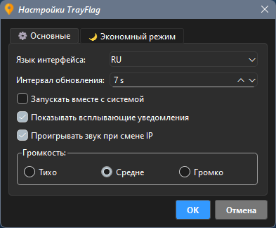
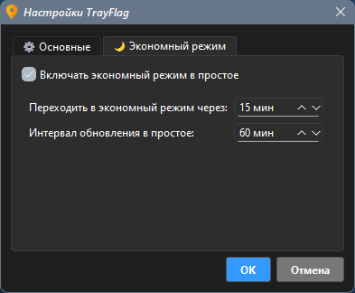
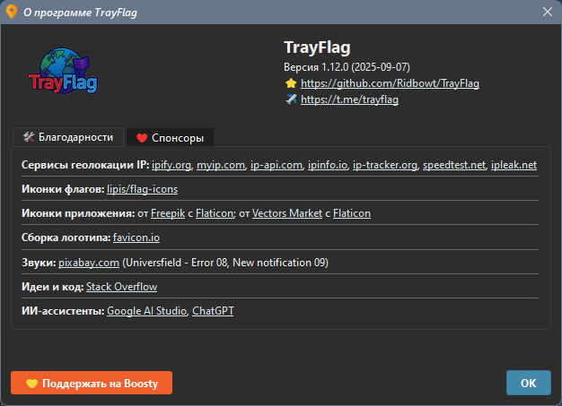

# TrayFlag 

[English](README.md) | **Русский**

Простой и мощный трей-индикатор для определения местоположения вашего IP-адреса.

TrayFlag — это легкая, портативная утилита для Windows, которая отображает флаг страны вашего текущего IP-адреса прямо в системном трее. Это идеальный инструмент для всех, кто хочет быстро отслеживать свое сетевое местоположение.

## Функции
- **Иконка в трее в реальном времени:** Мгновенно отображает флаг страны вашего текущего IP-адреса.
- **Интеллектуальный мониторинг IP:** Приложение эффективно отслеживает ваш внешний IP-адрес, запрашивая полные данные геолокации (страна, город, провайдер) только при необходимости. Такой подход значительно сокращает количество запросов к сервисам геолокации, делая приложение более эффективным и надежным.
- **Устойчивая работа:** Если сервисы геолокации временно недоступны или ваше интернет-соединение потеряно, приложение будет активно пытаться восстановить соединение и предоставлять важную информацию. Звуковое оповещение может уведомить вас о проблемах с сетью.
- **Подробная информация:** Чистая всплывающая подсказка показывает ваш IP, код страны, город и провайдера. Контекстное меню предоставляет полную, не сокращенную информацию.
- **Интерактивная история:** Просматривайте и копируйте 3 последних местоположения IP-адресов прямо из меню.
- **Постоянные обновления:** Приложение теперь постоянно проверяет ваш IP с единым, заданным пользователем "Интервалом обновления" (например, каждые 7 секунд с небольшой случайной вариацией), обеспечивая непрерывный мониторинг.
- **Полностью портативное:** Не оставляет следов в реестре. Все настройки хранятся в локальном файле `TrayFlag.ini`. Версия файла `TrayFlag.ini` автоматически обновляется при запуске, если она отличается от версии приложения.
- **Настраиваемое:** Удобный диалог настроек для управления "Интервалом обновления", уведомлениями, звуком и поведением автозапуска.
- **Многоязычное:** Поддерживает несколько языков с автоматическим определением языка вашей системы при первом запуске.

## Установка
1. Перейдите на страницу [Релизы](https://github.com/Ridbowt/TrayFlag/releases).
2. Загрузите последний `.zip` архив (например, `TrayFlag-v1.5.0-windows-x64.zip`).
3. Распакуйте архив. Будет создана папка `TrayFlag`.
4. Откройте папку `TrayFlag` и запустите `TrayFlag.exe`.

**Важное примечание:** Вы увидите множество файлов (`.dll`, `.pyd`) рядом с `TrayFlag.exe`. Среди них также есть `ip_lookup.exe`. Все эти файлы являются необходимыми частями приложения. `TrayFlag.exe` — это основная программа на Python, а `ip_lookup.exe` — это вспомогательный модуль, написанный на Go, который отвечает за получение IP-адреса.

## Системные требования
- **Операционная система:** Windows 10 (x64) или Windows 11 (x64).
- **Примечание:** Приложение несовместимо с Windows 7/8 или 32-битными системами из-за ограничений современных версий Python и требуемых библиотек.

## Как внести вклад
Нашли ошибку или есть идея для новой функции? Не стесняйтесь открыть новое обращение в разделе [Issues](https://github.com/Ridbowt/TrayFlag/issues).

---
*Это приложение было создано энтузиастом при значительной поддержке и консультациях со стороны ИИ-ассистентов (Gemini, ChatGPT).*

---
## Связь 📢

Следите за обновлениями TrayFlag в Telegram:  
[Канал TrayFlag](https://t.me/trayflag) 📲

---
## Поддержка ❤️

Если вам нравится TrayFlag и вы хотите поддержать разработку, можно сделать это через Boosty:  
[Поддержать на Boosty](https://boosty.to/trayflag) 💛